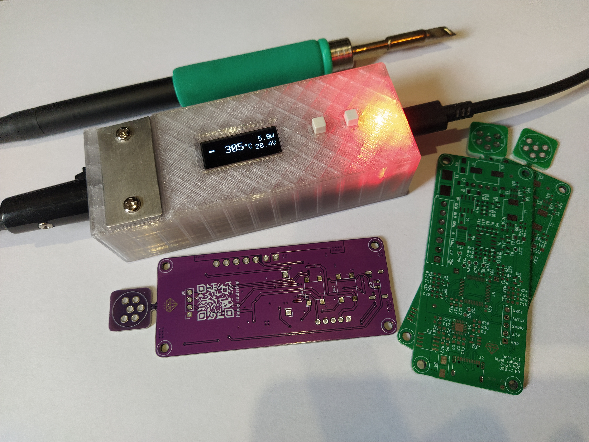
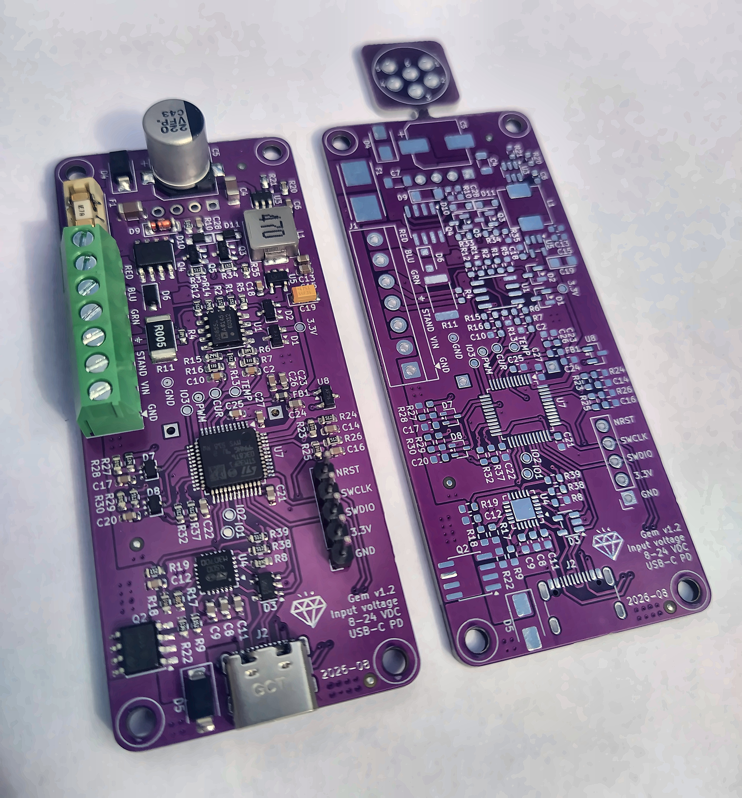
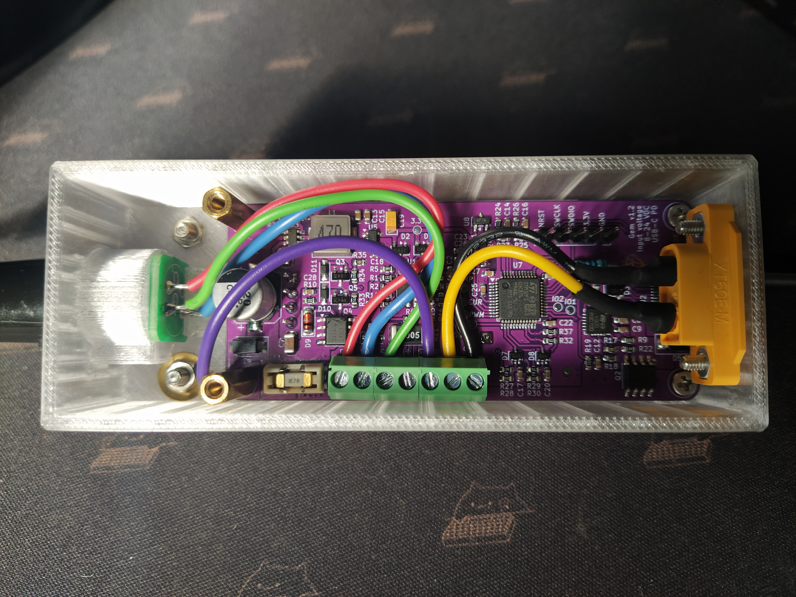
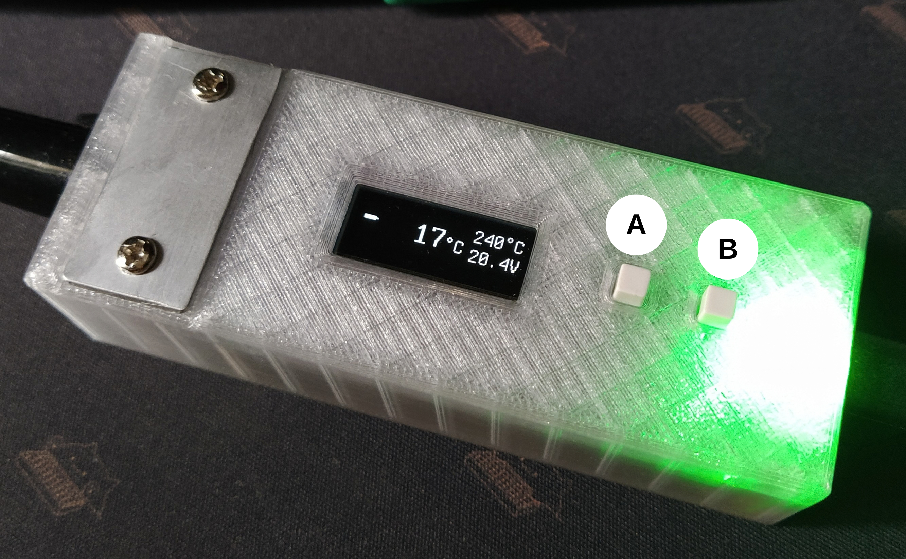

# 💎 Gem Solder

## Overview

Gem Solder is an STM32-powered soldering iron controller for general-purpose C245 tips.
It runs from a PD-compatible USB-C power source or from a DC power source of up to 24V,
including 3S–6S battery packs. USB-C power delivery negotiates up to 20V.

The user interface features a 128×32 OLED display and two buttons. An RGB
status LED gives visual feedback on the current operating mode.

The firmware is a fork of [IronOS](https://github.com/Ralim/IronOS). It ships with the IronOS feature set including a UI available in 35 languages.

The firmware measures the heater resistance of the fitted tip to compute how much power it can handle — up to 140W from DC and up to 100W over USB-C.
The delivered power therefore stays accurate across tips from different manufacturers.

Handle connector built into the 3D-printed housing. The housing carries the connector body, and a
matching PCB piece drops into it, so the pins and wires are soldered to that piece instead of a
special-purpose handle connector having to be sourced.

## Table of contents

- [Overview](#overview)
- [Features](#features)
- [Schematic](#schematic)
- [Hardware](#hardware)
- [Enclosure](#enclosure)
- [Firmware flashing](#firmware-flashing)
- [User interface](#user-interface)
- [Power supply recommendations](#power-supply-recommendations)
- [License](#license)

## Features

- Compact, DIY-friendly, two-layer 80×34 mm PCB.
- Current sensing feature measures the heater element's resistance to derive an
  accurate power estimate, so the iron works correctly with aftermarket tips whose resistance differs
  from the 2.4Ω of a genuine C245 tip.
- Resting the metal ring of the handle on a metal plate pulls the stand-sense input
  low and drops the iron to the sleep temperature, slowing tip oxidation. A quick
  tap on the plate toggles sleep when _Tap to sleep_ is enabled in the settings menu.
- An adjustable timeout setting returns the iron to the home screen and
  lets the tip cool down if it stays in sleep mode for too long.
- RGB status LED colour by mode:
  - 🟩 green - standby
  - 🟥 red pulse - heating
  - 🟥 red static - at setpoint
  - 🟦 cyan pulse - cooling, still hot
  - 🟪 violet - sleeping
- Once the DFU bootloader has been flashed to the device, all later firmware
  updates can be done over a USB data cable.
- PID temperature control, adjustable power limit, power pulse to keep power banks
  awake and more from IronOS.
- PD debug menu to read the power source capabilities.
- USB-C PD and an XT60 connector make it workable from a power bank or battery pack, for soldering away from the workbench.
- 20 kHz heater PWM keeps the switching noise of the high-current drive above the audible range, and
  its fine resolution gives smoother power control.

## Schematic

## Hardware

Gem Solder PCB was designed in [KiCad](https://www.kicad.org/). It's a two-layer board
with a breakaway panel for a handle connector.

The heart of the device is the STM32F103C8T6 — an ARM Cortex-M3 MCU with 20 KB RAM and
64 KB flash. The STUSB4500QTR is a standalone PD sink controller, responsible for PD
negotiation and VBUS management. It communicates with the MCU via I²C.

The AD8629ARZ is a high-precision, zero-drift operational amplifier that amplifies the
microvolt-level signal from the tip thermocouple.

The tip heater power stage consists of a P-channel MOSFET and a discrete push-pull driver
with a zener diode for maintaining the gate voltage at a safe operating level.

The AP63300WU-7 buck converter provides 4.6 V for biasing the WS2812 RGB LED, then a 3.3 V LDO
regulator steps that down to supply the MCU, the OLED, the op-amp, and the
ambient temperature sensor.

A 5 mΩ current sense resistor enables current measurement for accurate PWM duty
calculation and tip presence detection.

Here's a photo of the assembled and bare PCBs:

## Enclosure

Print the enclosure in a semi-transparent material to keep the status LED visible.

The 3D-printed enclosure has a built-in handle connector. Insert the connector PCB piece and
plug in the handle before soldering the pins and wires.

The image below shows how the connector needs to be wired to the screw terminal:

## Firmware flashing

The STM32F103 has no built-in USB bootloader, so the first flash needs an SWD programmer such
as ST-LINK or DAPLink, wired to the 5-pin SWD header on the board.

Once the DFU bootloader has been flashed, all later updates run over a USB data cable using
[dfu-util](https://dfu-util.sourceforge.net/).

## User interface

Two buttons control the device:

Their functions are as follows:

- **On device power-up:** click and hold button A to enter the DFU bootloader if that was
  flashed to the device. Click and hold button B to enter factory bootloader mode.
- **On the home screen:** click button A to enter soldering mode. Click button B to enter
  device settings. Click and hold button A to adjust the set temperature. Click and hold
  button B to enter the debug menu.
- **In the settings menu:** use button B to scroll and button A to select.
- **In the debug menu:** use button A to scroll and button B to exit. Click and hold button B
  while in the debug menu to enter the PD debug menu.
- **In soldering mode:** click either button to adjust the temperature. Click and hold button B
  to exit to the home screen.

## Power supply recommendations

If an SMPS DC power supply is chosen as a power source, a **SELV power supply with a floating
output is required**. Do not use power supply units whose DC output is connected to mains earth.
Due to how the C245 tips are internally constructed, they provide a low-impedance path between
the RED terminal, to which positive voltage is applied, and the GREEN terminal, which is
connected to mains earth. While the Gem Solder's high-impedance path between the tip body and
the earth terminal should not cause a short circuit, PELV power supplies are not recommended
anyway.

⚠️ **Do not connect USB-C and DC power sources simultaneously!** USB and DC power paths are
internally joined on the board, so one power source ends up connected straight to another.

## License

Gem Solder PCB and enclosure designs are licensed under [CERN Open Hardware Licence Version 2](LICENSE-CERN-OHL-S).
Firmware code is covered by the [GNU General Public License v3.0](LICENSE-GPL-3.0) license unless noted elsewhere.
